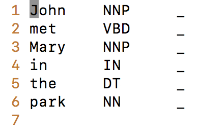

# lapos_server
An existing C++ CRF based POS tagger exposed as a service *(suitable for fast POS tagging at scale)*

This is a server version of a CRF based POS tagger (https://www.logos.ic.i.u-tokyo.ac.jp/~tsuruoka/lapos/)

The paper for the model https://acl-arc.comp.nus.edu.sg//~antho/W/W11/W11-0328.pdf

The server component is based on the repository https://github.com/rxi/dyad

# Requirements

g++ compiler

# Install steps

Type make

*Tested this Ubuntu 16.04*

# Usage

**Server**

./run_server.sh

**Client**

*wget -O out "http://127.0.0.1:8901/John met Mary in the park"*

**Output**

# License

MIT License for this server wrapper. Original tagger and server code also covered by MIT license.

*Dyad license*
https://github.com/rxi/dyad/blob/master/LICENSE

*POS tagger license*
http://www.logos.ic.i.u-tokyo.ac.jp/~tsuruoka/lapos/ 
